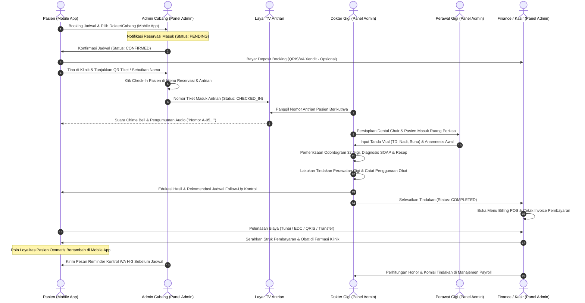

# DOKUMENTASI ALUR KESELURUHAN SISTEM PER ROLE
## NINA DENTAL CARE — INTEGRASI MOBILE APP & OFFICE PANEL ADMIN

Dokumen ini memetakan arsitektur operasional, siklus layanan klinik gigi, dan pembagian tugas per peran (*role-based workflow*) secara komprehensif, menghubungkan interaksi antara **Aplikasi Pasien (Mobile Flutter)** dan **Panel Manajemen Klinik (Admin Nuxt 3)** yang terhubung ke **Core API Backend**.

---

## 1. Bagan Alur Siklus Layanan Utama (End-to-End Clinic Journey)

Bagan berikut menggambarkan perjalanan lengkap pasien dari reservasi hingga perawatan, pembayaran, dan follow-up kontrol berkala:

---

## 2. Rincian Alur Kerja Komprehensif per Role

---

### A. ROLE: PASIEN (PENGGUNA MOBILE APP)
**Platform**: Aplikasi Mobile Android (Flutter)  
**Aktor**: Pasien Umum, Pasien Ortodonti, Orang Tua Pasien Anak  

#### Alur Langkah & Fitur:
1. **Registrasi & Onboarding**:
   - Pasien mendaftar mandiri menggunakan Nomor WhatsApp, Nama Lengkap, dan Password.
   - Sistem menghubungkan profil pasien ke Nomor Rekam Medis (Nomor RM) unik jika pasien pernah berobat sebelumnya.
2. **Pencarian Cabang & Dokter**:
   - Pasien dapat melihat daftar cabang terdekat (Cabang Soreang dan Cabang Baleendah) lengkap dengan fasilitas, lokasi peta, dan nomor kontak.
   - Melihat profil dokter gigi spesialis (Ortodonti, Konservasi Gigi, Gigi Anak, Periodonsia, Bedah Mulut, Dokter Gigi Umum) beserta jadwal praktek aktifnya.
3. **Reservasi Janji Temu (Booking)**:
   - Memilih cabang klinik -> dokter spesialis -> tanggal kunjungan -> jam slot sesi praktik.
   - Memilih jenis perawatan yang dibutuhkan (Scaling, Tambal Gigi, Behel, Cabut Gigi, Bleaching, dll.) serta menuliskan keluhan yang dirasakan.
   - Konfirmasi booking dan menerima kode tiket reservasi digital dengan status *PENDING / CONFIRMED*.
4. **Pembayaran Uang Muka / Deposit (Opsional)**:
   - Pasien dapat membayar biaya booking/deposit melalui gateway pembayaran resmi (QRIS, Transfer Bank Mandiri/BCA/BNI, dan e-Wallet).
5. **Monitoring Antrian Real-time**:
   - Saat hari-H kunjungan, pasien memantau antrian live dari aplikasi dan melakukan check-in setibanya di klinik.
6. **Riwayat Rekam Medis & Odontogram Pasien**:
   - Pasien dapat melihat riwayat kunjungan medis, rincian tindakan yang pernah dilakukan, serta anjuran dokter dan resep obat yang diterima.
7. **Pengingat Kontrol (Follow-up Reminder) & Poin Loyalitas**:
   - Pasien menerima pemberitahuan jadwal kontrol berkala (misal kontrol behel bulanan atau evaluasi scaling 6 bulan).
   - Setiap transaksi menghasilkan reward poin yang dapat ditukarkan dengan voucher diskon perawatan.

---

### B. ROLE: SUPERADMIN (OWNER / DIREKSI KLINIK)
**Platform**: Office Panel Web (Desktop / Tablet)  
**Aktor**: Pemilik Klinik, Direktur Medis, IT Administrator  

#### Alur Langkah & Fitur:
1. **Dashboard Eksekutif Konsolidasi**:
   - Memantau performa seluruh cabang secara terpusat: total omset harian/bulanan, jumlah kunjungan pasien, tingkat utilisasi dokter, dan breakdown metode pembayaran.
2. **Manajemen Pengguna & Role RBAC**:
   - Mendaftarkan akun staf, menentukan hak akses (*Superadmin, Admin Cabang, Dokter, Perawat, Finance*), dan mengatur cabang penugasan staf.
   - Mengelola akun pengguna aplikasi mobile (verifikasi profil, reset kata sandi, blokir/aktifkan akun).
3. **Pengaturan Cabang & Poliklinik**:
   - Menambah cabang baru, mengatur kapasitas dental chair unit, jam operasional, dan kontak klinik.
4. **Manajemen Master Layanan & Tarif**:
   - Mengatur daftar perawatan klinik, kategori layanan, durasi waktu standar, dan penetapan tarif dasar.
5. **Kebijakan Poin Loyalitas & Promo**:
   - Mengonfigurasi rasio perolehan poin (misal: belanja Rp 10.000 = 1 Poin) dan minimum penukaran poin.
   - Menyetujui banner promosi, diskon musiman, dan voucher promo.
6. **Audit Trail & Keamanan Sistem**:
   - Menginspeksi Log Aktivitas Pengguna (siapa mengubah rekam medis, siapa mengedit transaksi billing).
   - Memantau Log Error Aplikasi untuk menjaga stabilitas sistem.
7. **Laporan Finansial & Laba Rugi**:
   - Meninjau laporan laba-rugi komprehensif, trend pendapatan kotor vs pengeluaran operasional, dan kinerja finansial multi-cabang.

---

### C. ROLE: ADMIN CABANG (FRONT OFFICE / RESEPSIONIS)
**Platform**: Office Panel Web  
**Aktor**: Resepsionis Front Desk, Customer Service Cabang  

#### Alur Langkah & Fitur:
1. **Verifikasi & Konfirmasi Reservasi**:
   - Membuka menu **Reservasi & Antrian** setiap pagi untuk memvalidasi pasien yang mendaftar via mobile.
   - Mengonfirmasi slot waktu dokter atau berkoordinasi jika terdapat perubahan jadwal dokter.
2. **Pendaftaran Pasien Walk-in (On-Site)**:
   - Mendaftarkan pasien langsung yang datang ke klinik tanpa reservasi mobile sebelumnya.
   - Membuat kartu rekam medis baru untuk pasien baru.
3. **Proses Check-in Pasien**:
   - Saat pasien tiba di klinik, staf mencari nama pasien atau memindai kode tiket reservasi, lalu menekan tombol **Check-in**.
   - Sistem mencetak nomor antrian fisik dan memasukkan pasien ke antrian aktif layar TV.
4. **Manajemen Display Antrian TV Klinik**:
   - Mengoperasikan menu **Display Antrian TV** di ruang tunggu klinik.
   - Membantu pemanggilan nomor antrian (panggil berikutnya, panggil ulang suara Text-to-Speech) jika dokter meminta bantuan pemanggilan.
5. **Notifikasi & Broadcast Pasien**:
   - Mengirimkan pengumuman penting atau notifikasi via WhatsApp/Push Notification terkait info operasional klinik.

---

### D. ROLE: DOKTER (DOKTER GIGI SPESIALIS & UMUM)
**Platform**: Office Panel Web (Desktop / Laptop di Ruang Praktik)  
**Aktor**: drg. Spesialis Ortodonti, drg. Spesialis Gigi Anak, drg. Konservasi Gigi, drg. Umum  

#### Alur Langkah & Fitur:
1. **Melihat Jadwal Pasien Harian**:
   - Dokter membuka panel dan melihat daftar janji temu pasien khusus di polikliniknya untuk hari tersebut.
2. **Pemanggilan Pasien ke Ruang Praktik**:
   - Menekan tombol panggil pada sistem antrian yang otomatis memicu audio chime dan suara di Layar TV ruang tunggu ("*Nomor antrian A-05, Budi Santoso, silakan menuju Dental Unit 1 drg. Friski*").
3. **Anamnesis & Input Rekam Medis (EHR)**:
   - Membaca riwayat keluhan pasien, riwayat alergi obat (misal Penicillin), dan penyakit sistemik (Hipertensi, Diabetes, Jantung, dsb.).
   - Memeriksa keluhan utama dan riwayat penyakit sekarang.
4. **Pengisian Odontogram Digital (FDI 2-Digit Matrix)**:
   - Membuka diagram status 32 gigi (Rahang Atas 18–28, Rahang Bawah 48–38).
   - Menandai kondisi gigi secara visual: *Karies (Caries), Tambalan (Filled), Gigi Dicabut (Extracted), Mahkota (Crown), Bleaching, Impaksi*.
5. **Catatan Klinis SOAP & Tindakan Medis**:
   - Mengisi S (*Subjective*), O (*Objective*), A (*Assessment / Diagnosis Medis*), dan P (*Plan / Rencana Terapi*).
   - Mencatat tindakan prosedural yang dieksekusi (misal: preparasi kavitas, penambalan komposit, scalling subgingival, odontektomi).
6. **Pembuatan Resep Obat (Rx)**:
   - Meresepkan obat antibiotik, analgesik, atau obat kumur antiseptik dengan dosis dan aturan pakai yang jelas.
7. **Instruksi Follow-up Kontrol**:
   - Menetapkan jadwal kontrol lanjutan (misal 7 hari pasca-cabut gigi, atau 30 hari untuk penyesuaian kawat gigi).
   - Menyimpan rekam medis secara aman (data terlindungi dan tercatat pada audit log).

---

### E. ROLE: PERAWAT (DENTAL ASSISTANT)
**Platform**: Office Panel Web (Tablet / PC Klinik)  
**Aktor**: Perawat Gigi, Asisten Bedah Gigi  

#### Alur Langkah & Fitur:
1. **Persiapan Ruang Tindakan (Dental Chair Preparation)**:
   - Memastikan kebersihan dental unit, alat steril (*tray set*), handpiece, dan bahan dental siap sebelum pasien masuk.
2. **Pengukuran Tanda Vital Pasien**:
   - Melakukan anamnesis awal dan mengukur tanda vital pasien (Tekanan Darah mmHg, Denyut Nadi x/menit, dan Suhu Tubuh °C), lalu menginputnya ke form rekam medis.
3. **Asistensi Tindakan Klinis**:
   - Membantu dokter saat tindakan medis (suction saliva, penyiapan bahan tambal, light-curing, mixing semen dental).
4. **Manajemen Inventaris Alat & Obat**:
   - Mengelola stok obat-obatan, jarum anestesi, bahan tumpatan gigi, dan dental consumable di menu **Inventaris (Alat & Obat)**.
   - Memantau peringatan stok menipis (*reorder threshold*) dan mencatat penerimaan stok baru.
5. **Edukasi Pasca Perawatan**:
   - Memberikan petunjuk perawatan gigi di rumah kepada pasien setelah tindakan selesai (cara sikat gigi pasca tambal, pantangan makan/minum, dsb.).

---

### F. ROLE: FINANCE (KEUANGAN & KASIR KLINIK)
**Platform**: Office Panel Web  
**Aktor**: Staf Keuangan, Kasir Klinik, Bendahara  

#### Alur Langkah & Fitur:
1. **Kasir POS & Penerbitan Tagihan (Billing)**:
   - Setelah dokter menyelesaikan tindakan, kasir membuka menu **Billing & Transaksi**.
   - Sistem otomatis menghitung total biaya perawatan, obat-obatan, dan biaya konsultasi.
   - Mengurangi deposit awal yang telah dibayarkan pasien (jika ada).
   - Memproses pembayaran via Cash, Mesin EDC Kartu Debit/Kredit, QRIS, atau Transfer Bank.
   - Mencetak invoice resmi dan kwitansi berstempel untuk pasien.
2. **Manajemen Honor & Gaji Pegawai (Payroll)**:
   - Mengelola kompensasi bulanan seluruh pegawai: dokter spesialis, dokter gigi umum, perawat, kasir, dan staf administrasi.
   - **Formula Perhitungan Otomatis**:
     $$\text{Net Pay} = \text{Gaji Pokok} + (\text{Omset Tindakan} \times \text{Rate Komisi \%}) + \text{Tunjangan} - \text{Potongan (BPJS/PPH/Kasbon)}$$
   - Mengatur alokasi periode fleksibel berdasarkan **Bulan** dan **Tahun** referensi.
   - Mencetak Slip Gaji resmi per pegawai lengkap dengan rincian penerimaan dan tanda tangan finance.
3. **Pencatatan Pengeluaran Operasional (Expenses)**:
   - Mencatat pengeluaran harian klinik (pembelian bahan habis pakai, operasional listrik/air, pemeliharaan autoclave/kompresor, promosi).
4. **Laporan Finansial & Rekonsiliasi**:
   - Menghasilkan laporan omset harian per metode bayar, rekonsiliasi kas kasir, trend pendapatan mingguan/bulanan, dan laporan pembagian komisi dokter.

---

## 3. Matriks Hak Akses Modul per Role (RBAC Matrix)

| Modul Panel Admin | Superadmin | Admin Cabang | Dokter | Perawat | Finance | Pasien (Mobile) |
| :--- | :---: | :---: | :---: | :---: | :---: | :---: |
| **Dashboard Ringkasan** | Full | Operasional | Sesi Pribadi | Sesi Pribadi | Keuangan | Ringkasan Mobile |
| **Reservasi & Antrian** | Full | Full | Read (Jadwalnya) | Read | Read | Booking Mandiri |
| **Display Antrian TV** | Kontrol | Kontrol | Call Voice | Read | Read | Monitor Ruang |
| **Data Pasien** | Full | Full | Read Pasiennya | Read | Read | Profil Mandiri |
| **Dokter & Jadwal** | Full | Read | Read | Read | Read | Lihat Jadwal |
| **Cabang Klinik** | Full | Read | Read | Read | Read | Lihat Lokasi |
| **Perawatan & Tarif** | Full | Read | Read | Read | Read | Lihat Katalog |
| **Rekam Medis (EHR)** | Full | Read Status | Full (Tulis/Edit)| Asistensi | Read Biaya | Lihat Riwayat |
| **Odontogram Digital** | Full | No | Full (Input) | Read | No | Lihat Diagram |
| **Inventaris (Alat & Obat)**| Full | Read | Read | Full (Input Stok)| Read | No |
| **Billing POS & Invoice** | Full | Kasir | Read | No | Full | Riwayat Bayar |
| **Honor & Gaji (Payroll)** | Full | No | Read Pribadi | No | Full (Hitung) | No |
| **Laporan Keuangan** | Full | No | Read Komisi | No | Full | No |
| **Promo & Voucher** | Full | Read | Read | Read | Read | Klaim Promo |
| **CMS Konten & Artikel** | Full | Draft | No | No | No | Baca Artikel |
| **User & Role (RBAC)** | Full | No | No | No | No | No |
| **Log Aktivitas & Sistem** | Full | No | No | No | No | No |

---

## 4. Keunggulan Integrasi Mobile dan Office Panel

1. **Sinkronisasi Instan Data Pasien**: Pasien yang mendaftar di Mobile langsung memiliki record di database klinik, mempercepat pendaftaran di meja resepsionis tanpa kertas manual.
2. **Keterpaduan Odontogram & Billing**: Tindakan yang dicatat dokter pada odontogram langsung menjadi item rincian pada billing kasir, meminimalisir salah input harga atau kebocoran tarif.
3. **Penyelarasan Display Antrian & Pemanggilan Bersuara**: Mengurangi kerumunan di depan ruang praktek karena pasien dapat duduk nyaman menunggu panggilan otomatis melalui TV Display di lobi klinik.
4. **Otomatisasi Komisi Dokter**: Komisi tindakan dokter terkalkulasi secara transparan dari data transaksi valid dan langsung terangkum pada slip gaji bulanan.
